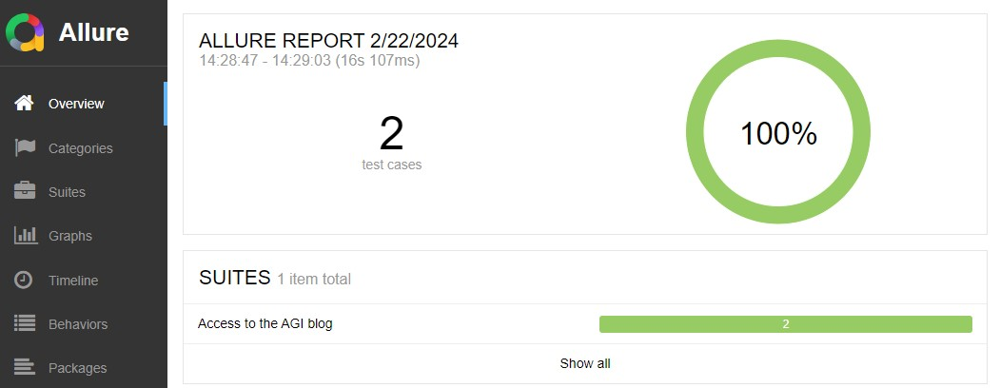
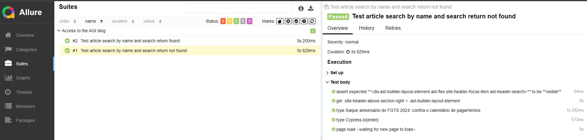
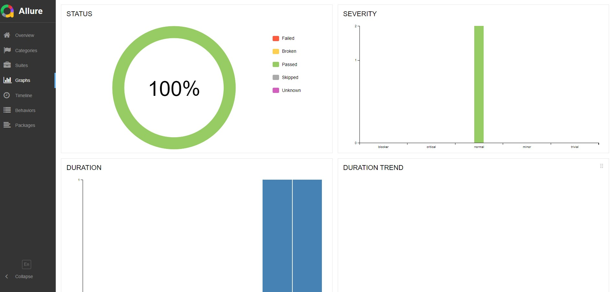
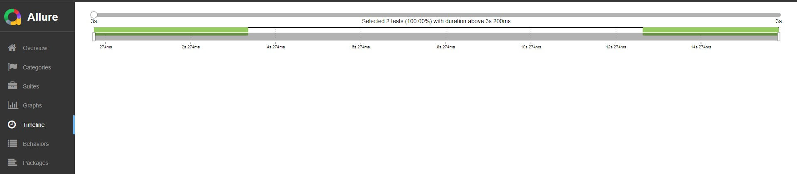

# Pesquisa de Artigos Blog AGI
## Tecnologias

  - Cypress @ 13.6.5
  - NodeJS @ v16.20.0
  - NPM @ 8.19.4

## Setup

### Pré-requisitos:
- Instalar o NodeJS
- Instalar um editor de texto, como o Visual Studio Code
- Instalar o Git (caso queira trabalhar com projeto em sua máquina)

## Passos para executar o projeto

  - Clonar o repositório
  - Dentro da raiz do projeto, executar o comando [npm install]
  - Executar os comandos a seguir para rodar os testes em modo headless nos navegadores:
      
    - Electron: [npm run cy:run:electron]
    - Chrome: [npm run cy:run:chrome]
    - Firefox: [npm run cy:run:firefox]
    - Edge: [npm run cy:run:edge]

    Interface gráfica Cypress: 
    - No terminal rodar: npx cypress open
    - Irá abrir a tela do cypress
    - Seleciona a opção E2E Testing
    - Clica no botão Start E2E
    - Na tela com a aba já selecionada Specs, seleciona teste desejado e ele vai começar a rodar.

    Documentação dos testes em Gherkin:

    - Acessa pasta e2e/docs/
    - Acessa pasta e2e/scenarios/

    Rodar teste em modo headless e gerar relatório pelo allure:

    - Para um teste especifico: npx cypress run nometeste.cy.js --config video=false --env allure=true
    - Para todos os testes: cypress run --env allure=true
    - allure generate allure-results
    - allure open allure-report

[Cypress Cloud](https://cloud.cypress.io/projects/51exbc/runs?branches=%5B%5D&committers=%5B%5D&flaky=%5B%5D&page=1&status=%5B%5D&tags=%5B%5D&tagsMatch=ANY&timeRange=%7B%22startDate%22%3A%222023-02-22%22%2C%22endDate%22%3A%222024-02-22%22%7D)

